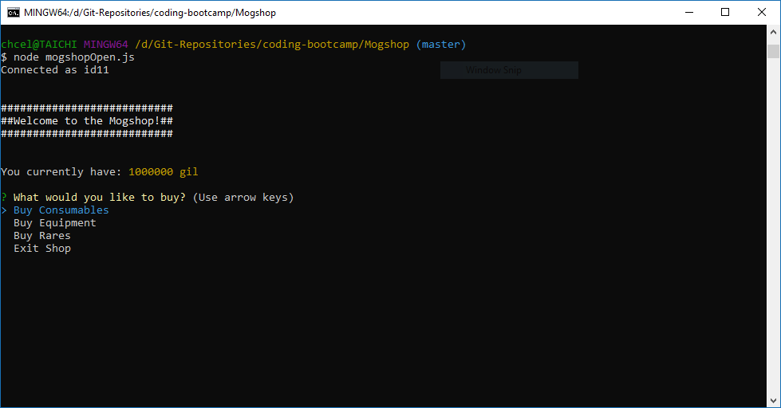
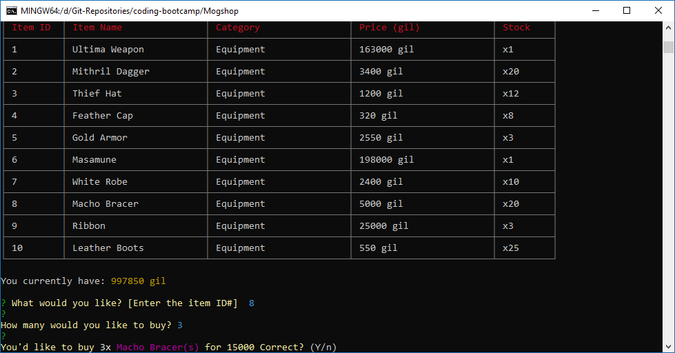

# __Mogshop__ 
`Mogshop` is virtual command line interface storefront, loosely based around items and currency(gil) that exists in the roleplaying game series, Final Fantasy. Mogshop simulates a storefront in that you have a finite amount of currency that you can then spend on buying several many of the numerous items available in the storefront.

Mogshop was created primarily through Javascript and supplemental packages provided and utillized through Node.js. I also utilized mySQL in order to dynamically store and retrieve the storefront data.




---
## __How to Install/Use:__
1. Clone down repository.
2. Install required `Node.js` packages with:
    ```
    $ npm install
    ```
3. Create database/tables defined in `mogshop.sql` in MySQL Workbench.
4. Run `mogshopOpen.js` via `Node.js`.
    ```
    $ node mogshopOpen.js
    ```
5. Buy as many items as you want with your `1,000,000 gil` allowance!

---
## __Technologies Used__

* Javascript
* [Node.js](https://nodejs.org/en/)
* [Chalk](https://www.npmjs.com/package/chalk)
* [Inquirer](https://www.npmjs.com/package/inquirer)
* [CLI-Table](https://www.npmjs.com/package/cli-table)
* [MySQL](https://www.mysql.com/)